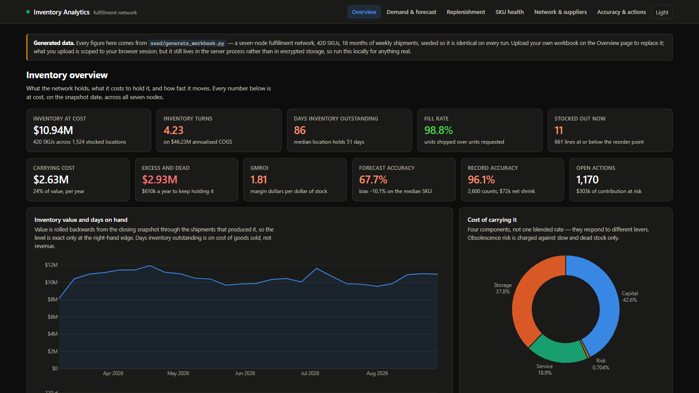

# Inventory Analytics · Operations Decision Studio

[](https://github.com/KushPatel29/inventory-analytics-app/actions/workflows/ci.yml)


[](https://inventory-analytics-app.onrender.com/)

**[Open the live decision studio](https://inventory-analytics-app.onrender.com/)**

**[Review the business-analysis case and 8-minute interview walkthrough](docs/business-analysis-and-interview-guide.md)**

A six-workspace inventory planning application that turns WMS and ERP extracts into a governed action register. It connects demand forecasting, replenishment, working capital, network balancing, supplier performance, cycle-count accuracy, and downloadable handoff files in one traceable workflow.

This is intentionally more than a dashboard. Every analytical page ends in a planning decision, an export, or a named action with its operational and financial meaning kept separate.



## The operating questions

| Workspace | Decision supported | Evidence produced |
|---|---|---|
| **Overview** | Where is cash tied up, and what changed? | Inventory value, turns, DIO, GMROI, carrying-cost bridge, ABC concentration |
| **Demand & forecast** | Which forecast should plan each SKU? | Seven-method rolling-origin backtest, actual vs forecast, MASE, bias, seasonality, method mix |
| **Replenishment** | What should be ordered now, in what quantity, and why? | Safety stock, reorder point, inventory position, EOQ, urgency and service-level response |
| **SKU health** | Which items deserve tighter control, reduction, or exit? | ABC-XYZ policy matrix, ageing, movement state, excess and dead-stock exposure |
| **Network & suppliers** | Can existing stock solve the problem before another buy? | Economically screened transfers, node balance, PO risk and a four-factor supplier scorecard |
| **Accuracy & actions** | Which exceptions need an owner next? | Record/value accuracy, shrinkage bridge, count coverage and six-verb action register |

## Reproducible demo snapshot

The hosted app starts with a deterministic, synthetic network dated **2026-08-29**. It contains **420 SKUs**, **7 nodes**, **78 weekly periods**, and nine source tables. The seeded snapshot surfaces realistic trade-offs instead of uniformly random noise:

- **$10.94M** inventory at cost, **4.23 turns**, and **86.4 days** inventory outstanding.
- **98.82%** fill rate alongside **11 stockouts** and **661** stocked positions at or below reorder point.
- **$2.93M** excess-and-dead-stock cash opportunity and **$2.63M** annual carrying cost.
- **595** order-due lines representing **$3.58M** and **95,488 units**.
- **58** dead-stock SKUs worth **$385.6k** and **36** slow movers worth **$157.2k**.
- **96.12%** record accuracy, **99.50%** value accuracy, and **$72.1k** net shrinkage.
- **1,170** prioritized actions across Expedite, Reorder, Transfer, Investigate, Reduce, and Liquidate.

All figures are generated. The interface labels provenance, snapshot date, grain, and material limitations so a reviewer can distinguish demonstrated methods from real company outcomes.

## Why the analysis is defensible

### Forecasting that earns the right to be used

Seven methods compete for every SKU: naïve, 4- and 13-week moving averages, simple exponential smoothing, Holt trend, seasonal naïve, and Croston/SBA for intermittent demand. The winner is selected on MASE across a rolling-origin backtest. Forecasts are made at SKU level, then allocated to nodes, avoiding the false precision of independently forecasting sparse SKU-node series.

### Planning mathematics with the important terms included

Safety stock covers both demand variability and observed lead-time variability. Reorder decisions use inventory position—on hand plus inbound minus allocated—not on-hand alone. Service levels differ by ABC class, and the interface exposes the effect of parameter changes rather than hiding them inside constants.

### Decisions before additional purchasing

The allocation engine first finds network surplus that can cover a deficit, estimates lane cost, and only recommends a transfer when the move has a positive modeled benefit. Replenishment then works from the remaining position. Supplier performance uses observed receipts to score on-time delivery, fill, quality, and lead-time reliability.

### Operational and financial definitions stay explicit

ABC is based on annual consumption value, DIO uses cost of goods sold, and carrying cost is split into capital, storage, service, and risk components. Record accuracy, value accuracy, and net shrinkage are reported separately because they answer different management questions. Action-register impacts are ranked within each verb rather than summed into a misleading total.

## Data and decision flow

```text
9-sheet WMS / ERP workbook
        │
        ▼
schema checks · cleaning · full-week demand grid · session isolation
        │
        ▼
forecasting · segmentation · replenishment · allocation · supplier · accuracy
        │
        ├── 36 tested JSON report endpoints
        ├── 6 responsive decision workspaces
        ├── CSV and Excel handoff files
        └── unified, financially ranked action register
```

The committed `data/` directory provides the same nine generated sources as flat files for SQL and Power BI work. `sql/inventory_marts.sql` builds demand, segmentation, supplier, replenishment, accuracy, and working-capital marts in DuckDB.

## Tested controls

The suite contains **289 tests**, including:

- formula and edge-case checks for forecasting, safety stock, reorder points, EOQ, allocation, ageing, accuracy, and supplier scoring;
- generated-data invariants that keep the demo realistic and deterministic;
- end-to-end workbook ingestion, visitor session isolation, all six pages, all 36 JSON reports, and six file downloads;
- **14 Python-to-SQL parity tests** so warehouse marts cannot silently drift from the application engine;
- accessible navigation landmarks, keyboard focus, current-page state, theme-control semantics, and reduced-motion support;
- smoke tests for both uploaded-workbook and hosted auto-load paths.

Run the release check:

```bash
python -m pytest -q
python scripts/demo_autoload_smoke.py
```

## Run locally

```bash
python -m venv .venv
# Windows: .venv\Scripts\activate
# macOS/Linux: source .venv/bin/activate
pip install -r requirements.txt

python -m seed.generate_workbook --csv-dir data
python run.py
```

Open `http://127.0.0.1:5000`. The generated workbook is loaded automatically. Set `DEMO_AUTOLOAD=0` to begin empty and upload a nine-sheet `.xlsx` file.

Useful exports are available directly in the application:

- filtered replenishment, SKU-health, transfer, and action-register CSVs;
- a replenishment workbook;
- a complete multi-sheet analysis workbook.

## Deployment

The public demo runs as a one-worker, four-thread Docker service on Render. A single worker is deliberate: uploaded analysis state lives in process memory and is isolated by a signed browser-session identifier. The container uses Python 3.12, secure HTTPS cookies, a `/healthz` readiness route, and generated demo data on cold start.

```bash
docker build -t inventory-analytics .
docker run --rm -p 8000:8000 inventory-analytics
```

`render.yaml` mirrors the live Docker deployment so the hosting configuration is reviewable with the code.

## Privacy and method boundaries

- The public demo data is entirely synthetic and reproducible from a fixed seed.
- An uploaded workbook is isolated to that browser session, but it remains in the server process rather than encrypted persistent storage. Use a local deployment for sensitive data.
- Forecasts and recommendations are decision support, not autonomous orders. Freight, service-level, and reserve assumptions are modeled parameters that require local validation before operational use.
- The repository includes Power BI-ready flat files and tested SQL marts; it does **not** claim a packaged `.pbix` model that is not present in the public code.
