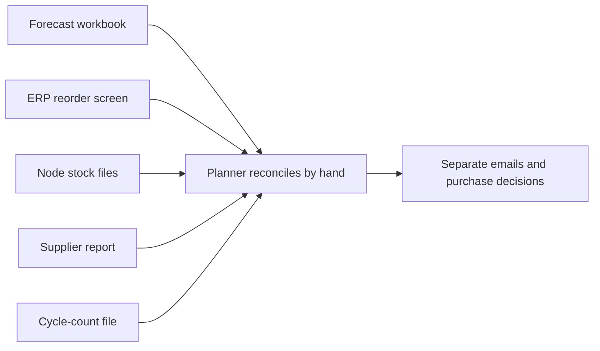
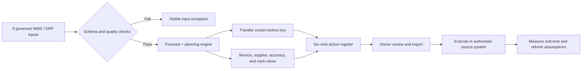

# Business Analysis and Interview Guide

This guide makes the decision work behind the live application easy to review
in an interview. It connects the operating problem, stakeholders,
requirements, workflow, controls, acceptance evidence, and limitations to the
six workspaces in the [live decision studio](https://inventory-analytics-app.onrender.com/).

## Evidence Boundary

The network, organisations, users, dates, transactions, costs, and findings are
synthetic and reproducible from the repository's fixed seed. The application
demonstrates an end-to-end analysis and delivery pattern; it does not claim
that the modelled cash opportunity was realised by an employer or that its
recommendations should be executed without local policy, capacity, and cost
validation.

## Executive Brief

### Decision problem

Inventory decisions are often split across a forecast workbook, an ERP reorder
screen, supplier reports, cycle-count files, and finance's working-capital
analysis. Each view can be correct on its own while the operating decision is
wrong: a buyer orders against on-hand instead of inventory position, one node
buys while another holds transferable surplus, a high fill rate hides a small
set of severe stockouts, or cash opportunity is presented as if every dollar
could be released immediately.

### Proposed change

Create one controlled weekly planning workflow that:

1. validates nine WMS/ERP inputs and preserves the snapshot basis;
2. selects a forecast method using out-of-sample evidence;
3. calculates safety stock, reorder point, EOQ, and inventory position;
4. screens economically useful transfers before recommending another buy;
5. separates service, supplier, accuracy, and working-capital signals; and
6. ends in an owned action register with downloadable handoff evidence.

### Seeded snapshot

The default 2026-08-29 scenario contains 420 SKUs across seven nodes and 78
weeks of demand. It shows $10.94M of inventory at cost, 98.82% fill rate, 11
stockouts, 661 stocked positions at or below reorder point, $2.93M of
excess-and-dead-stock cash opportunity, and 1,170 prioritised actions. These
figures are generated findings, not production outcomes.

### Recommendation

Use the studio as decision support for a time-boxed planning pilot. Begin with
one category and a representative set of nodes, validate parameters and action
ownership with buyers, warehouse leaders, Finance, and suppliers, then compare
recommended versus accepted actions. Do not automate purchase orders or stock
moves until the organisation has approved service policies, cost assumptions,
segregation of duties, and exception handling.

## Stakeholders and Decisions

| Stakeholder | Decision or concern | Evidence in the studio |
|---|---|---|
| Inventory planner / buyer | What to expedite, reorder, transfer, reduce, or liquidate? | Replenishment and unified action register |
| Warehouse / operations lead | Which node shortages, excess positions, and count exceptions need action? | Network balance, SKU health, cycle-count accuracy |
| Supply-chain leader | Are service, working capital, and supplier risk moving together? | Overview, trends, supplier scorecard |
| Finance | Which values are inventory at cost, annual carrying cost, cash opportunity, or modelled benefit? | Working-capital bridge and labelled impact definitions |
| Sales / customer service | Which service risks need escalation, and which inventory change could affect availability? | Stockout, fill-rate, demand, and action evidence |
| Supplier / procurement owner | Which suppliers miss timing, quantity, quality, or lead-time reliability expectations? | Four-factor scorecard and open-PO detail |
| Data / application owner | Are inputs complete, private between visitors, reproducible, and consistent with SQL marts? | Ingestion controls, session isolation, test suite, parity checks |

## Current and Future Workflow

The application deliberately stops before execution. That keeps the human
decision, local authority, and source-system control visible.

## Requirements and Acceptance Trace

| ID | Requirement | Priority | Acceptance evidence |
|---|---|---:|---|
| INV-BR-01 | A reviewer can identify the snapshot date, source grain, and material limitations. | Must | Every workspace exposes the shared snapshot context and the README records the data boundary. |
| INV-BR-02 | The planning forecast is selected using out-of-sample evidence rather than in-sample fit. | Must | Seven methods compete by SKU in rolling-origin backtests; tests cover selection and edge cases. |
| INV-BR-03 | Reorder logic uses inventory position, not on-hand alone. | Must | On hand, inbound, and allocated demand contribute to the tested reorder calculation. |
| INV-BR-04 | Safety stock accounts for both demand and observed lead-time variability. | Must | Formula tests cover variability terms, zero-demand cases, and bounded outputs. |
| INV-BR-05 | Network surplus is considered before an additional purchase. | Must | Transfer candidates are screened by lane cost and positive modelled benefit before replenishment is finalised. |
| INV-BR-06 | Supplier performance separates timeliness, completeness, quality, and reliability. | Should | The scorecard exposes all four factors and the delivered-versus-contracted lead-time gap. |
| INV-BR-07 | Accuracy reporting distinguishes record accuracy, value accuracy, and net shrinkage. | Must | Each metric is calculated and displayed separately; test cases prevent the definitions from collapsing into one number. |
| INV-BR-08 | Each recommendation retains its action, rationale, operational quantity, and financial meaning. | Must | The six-verb action register and exports keep impacts comparable within action type, not as one misleading total. |
| INV-BR-09 | One visitor cannot see another visitor's uploaded workbook. | Must | Signed session isolation is exercised end to end in the application tests. |
| INV-BR-10 | Application and warehouse calculations cannot silently diverge. | Must | Fourteen parity tests reconcile the Python engine to DuckDB SQL marts. |
| INV-BR-11 | Priority workflows are usable across responsive layouts and both themes. | Should | Navigation, focus, current-page state, reduced motion, and automated accessibility checks are tested. |
| INV-BR-12 | A reviewer can challenge demand, lead time, and service assumptions without changing the approved plan. | Must | The Policy Lab holds inventory position fixed, bounds inputs, recomputes network buffers/orders/exposure and labels every output simulated and approval-required. |
| INV-BR-13 | Forecast quality is visible at the same segment grain used for inventory policy. | Must | All 420 forecasted SKUs reconcile to one ABC-XYZ cell with volume-weighted accuracy, MASE, bias and review status. |

## Why the Decision Logic Is Defensible

### Forecast before replenishment

Naïve, moving-average, exponential-smoothing, Holt, seasonal-naïve, and
Croston/SBA approaches compete on rolling-origin MASE. The application avoids
the false precision of fitting independently to every sparse SKU-node series:
it selects at SKU level, then allocates to nodes.

### Inventory position before another order

Reorder recommendations use on-hand plus inbound minus allocated demand.
Safety stock includes demand and observed lead-time variability, while EOQ is
bounded to an operationally usable order cycle. The screen exposes policy
parameters so a stakeholder can test their effect rather than inherit a hidden
constant.

### Transfer before buy

When one node is short and another has usable surplus, the engine estimates the
lane cost and modelled benefit. Only positive-benefit moves are recommended,
and replenishment runs against the remaining position. This prevents a
purchase recommendation from ignoring stock the network already owns.

### Separate meanings before one headline

Inventory at cost, cash opportunity, annual carrying cost, avoided stockout
exposure, and supplier-related safety-stock burden are not added together.
Record accuracy, value accuracy, and net shrinkage remain separate for the same
reason: each supports a different management decision.

## UAT Scenarios

1. Load the deterministic workbook and reconcile the headline KPIs to the
   committed snapshot.
2. Select a SKU and explain why its winning forecast method beat the
   alternatives on out-of-sample evidence.
3. Change service level or planning parameters and verify safety stock,
   reorder point, risk, and recommended units respond in the expected
   direction.
4. Confirm a node shortage is reduced by an economically useful transfer
   before a new purchase is recommended.
5. Trace a supplier's grade to timing, fill, quality, and lead-time
   reliability rather than accepting the letter score alone.
6. Reconcile record accuracy, value accuracy, and shrinkage to cycle-count
   detail.
7. Filter and export the action register, preserving the visible scope and
   action rationale.
8. Upload a second workbook in another browser session and confirm the first
   visitor's results do not change.
9. Exercise keyboard navigation, visible focus, theme controls, responsive
   tables, and reduced motion.
10. Reject a malformed or incomplete source workbook with a specific,
    actionable error rather than partial results.
11. Run a 25% demand shock and a 30% lead-time shock; confirm buffer, order,
    and lead-window exposure move in the expected direction while the approved
    plan remains unchanged.
12. Review the service-cost frontier and ABC-XYZ forecast scorecard; confirm
    the economic screen is not presented as an approved service target and a
    weak segment cannot be hidden by network-level accuracy.

## Pilot and Adoption Plan

| Stage | Activity | Evidence to retain |
|---|---|---|
| Discover | Confirm planning cadence, source owners, service policies, cost assumptions, approval authority, and current baselines. | Stakeholder map, current-state process, metric definitions, issue baseline |
| Configure | Map local source fields, units, calendars, service tiers, lead times, order costs, and lane costs. | Data contract, parameter register, mapping and exception log |
| Validate | Run planner walkthroughs, formula reconciliation, scenario UAT, security/privacy review, and accessibility checks. | Traceability, UAT results, defects, decisions, release conditions |
| Pilot | Use one category and representative nodes; compare recommended, accepted, changed, and rejected actions. | Decision log, reason codes, task completion, service and cash guardrails |
| Adopt | Deliver role-based training, office hours, support routing, and a weekly review cadence. | Attendance/readiness, support themes, updated guidance |
| Scale or stop | Review benefit, service impact, planner effort, exceptions, data quality, and unintended behaviour. | GO / revise / stop brief with residual risk and next action |

Suggested adoption measures are task completion, time from exception to owned
decision, percentage of recommendations reviewed, override reasons, action
age, source-data exceptions, planner confidence, and service/cash guardrails.
They are proposed measures, not claimed results.

## Nine-Minute Interview Walkthrough

1. **Frame the problem (45 seconds).** Explain why six disconnected reports
   can produce one bad decision and why the end product is an action register.
2. **Show the executive tension (60 seconds).** Open Overview: 98.82% fill rate
   looks excellent beside 11 stockouts, 661 positions at/below reorder point,
   and $2.93M of modelled cash opportunity.
3. **Prove the demand signal (75 seconds).** Open Demand & forecast, select a
   SKU, explain rolling-origin model selection and MASE, then show how all 420
   SKUs reconcile to the ABC-XYZ model-assurance scorecard.
4. **Challenge the policy (120 seconds).** Open Replenishment; run demand and
   lead-time shocks, trace buffer/order/exposure changes, and compare the
   annual service-cost frontier. State that the economic screen is not an
   approved service promise or autonomous order.
5. **Avoid the unnecessary buy (75 seconds).** Open Network & suppliers and
   show why transfer economics runs before replenishment.
6. **Connect operations to control (60 seconds).** Show supplier factors,
   cycle-count definitions, and why record accuracy is not value accuracy.
7. **End with accountable action (60 seconds).** Filter the six-verb register
   and export the handoff evidence.
8. **Close on trust (45 seconds).** Point to the 316 tests, 14 Python/SQL parity
   checks, session-isolated uploads, live health route, and explicit limits.

## Questions I Would Ask Before Production Use

- Which service measure is being optimised: cycle service, unit fill, revenue
  fill, or a customer/contract-specific obligation?
- Which source owns on-hand, allocation, inbound, supplier terms, and item
  lifecycle, and how quickly must each be current?
- Are transfers operationally permitted across every node pair, and what costs,
  capacity, temperature, shelf-life, or customs constraints apply?
- Who can change planning parameters, approve orders, move stock, or write off
  inventory, and what segregation of duties is required?
- Which recommendation explanations and approvals must become official records?
- How will forecast overrides be captured and evaluated rather than silently
  replacing the model?
- What pilot result would justify scaling, revising, or stopping?

## Review the Evidence

- [Live decision studio](https://inventory-analytics-app.onrender.com/)
- [Project README](../README.md)
- [Application code](../invapp/)
- [Planning and analytics engine](../invapp/analytics/)
- [DuckDB marts](../sql/inventory_marts.sql)
- [Python-to-SQL parity checks](../tests/test_sql_matches_python.py)
- [Full test suite](../tests/)
